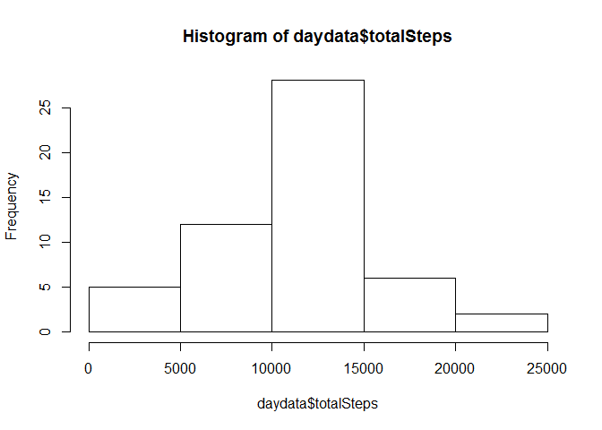
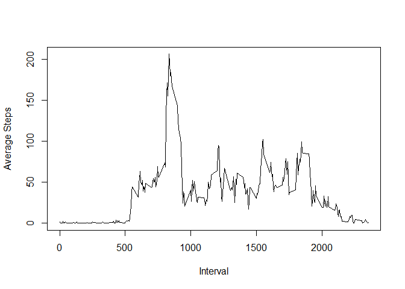
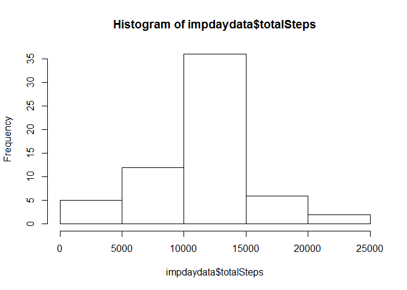
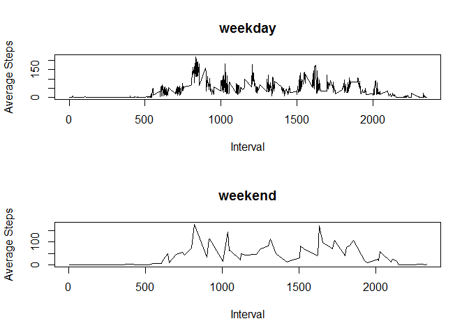

# Reproducible Research: Peer Assessment 1


## Loading and preprocessing the data

```r
    setwd("C:/Users/Lulu/RepData_PeerAssessment1")
    rd<-read.csv("activity/activity.csv")
```

## What is mean total number of steps taken per day?
Show a histogram and calculate the mean and median number of steps per day

```r
  daydata<-aggregate(rd$steps,list(date=rd$date),sum)
  daydata$totalSteps<-daydata$x
  daydata$x<-NULL

  hist(daydata$totalSteps)
```

 
Mean number of steps per day

```r
  mean(daydata$totalSteps[!is.na(daydata$totalSteps)])
```

```
## [1] 10766.19
```
Median number of steps per day

```r
  median(daydata$totalSteps[!is.na(daydata$totalSteps)])
```

```
## [1] 10765
```


## What is the average daily activity pattern?
Average number of steps per 5-minute interval

```r
  rd2<-rd[!is.na(rd$steps),]
  rd3<-aggregate(rd2$steps,list(interval=rd2$interval),mean)  
  rd3$avgSteps<-rd3$x
  rd3$x<-NULL
  plot(rd3$interval, rd3$avgSteps, type="l", xlab= "Interval", ylab= "Average Steps")
```

 
  
The 5-minute interval with the maximum number of average steps is:

```r
  rd3$interval[rd3$avgSteps==max(rd3$avgSteps)]
```

```
## [1] 835
```

## Imputing missing values
The number of days with missing values for steps is:

```r
   nrow(rd[is.na(rd$steps),])
```

```
## [1] 2304
```
Set missing values equal to to mean for the interval

```r
  impdata<-merge(rd,rd3,by="interval")
  impdata$impsteps<-impdata$steps
  impdata$impsteps[is.na(impdata$impsteps)]<-impdata$avgSteps[is.na(impdata$steps)]
```
Show a histogram and calculate the mean and median number of IMPUTED steps per day

```r
  impdaydata<-aggregate(impdata$impsteps,list(date=impdata$date),sum)
  impdaydata$totalSteps<-impdaydata$x
  impdaydata$x<-NULL

  hist(impdaydata$totalSteps)
```

 

```r
  mean(impdaydata$totalSteps)
```

```
## [1] 10766.19
```

```r
  median(impdaydata$totalSteps)
```

```
## [1] 10766.19
```
DIfference between mean steps with imputation and dropping NA:

```r
  mean(impdaydata$totalSteps)-mean(daydata$totalSteps[!is.na(daydata$totalSteps)])
```

```
## [1] 0
```
DIfference between median steps with imputation and dropping NA:

```r
  median(impdaydata$totalSteps)-median(daydata$totalSteps[!is.na(daydata$totalSteps)])
```

```
## [1] 1.188679
```
The mean value does not differ from the earlier estimate.
The median value does differ from the earlier estimate.

Imputation of missing data has minimal impact on the distribution of the estimates of the total daily number of steps.

## Are there differences in activity patterns between weekdays and weekends?
Plot of average steps for weekdays versus weekends

```r
  impdata$weekend<-c("weekend")
  impdata$weekday<-c("weekday")
  impdata$dayofweek<-weekdays(as.Date(impdata$date))
  impdata$daytype<-impdata$weekday
  impdata$daytype[impdata$dayofweek=="Sunday"]<-impdata$weekend[impdata$dayofweek=="Sunday"]
  impdata$weekend<-NULL
  impdata$weekday<-NULL
  impdata$dayofweek<-NULL

  impdata2<-aggregate(impdata$impsteps,list(daytype=impdata$daytype,interval=impdata$interval),mean)  
  impdata2$avgSteps<-impdata2$x
  impdata2$x<-NULL
  par(mfrow=c(2,1))
  plot(impdata2$interval[impdata$daytype=="weekday"], impdata2$avgSteps[impdata$daytype=="weekday"], type="l", main="weekday",xlab= "Interval", ylab= "Average Steps")
  plot(impdata2$interval[impdata$daytype=="weekend"], impdata2$avgSteps[impdata$daytype=="weekend"], type="l", main="weekend",xlab= "Interval", ylab= "Average Steps")
```

 
